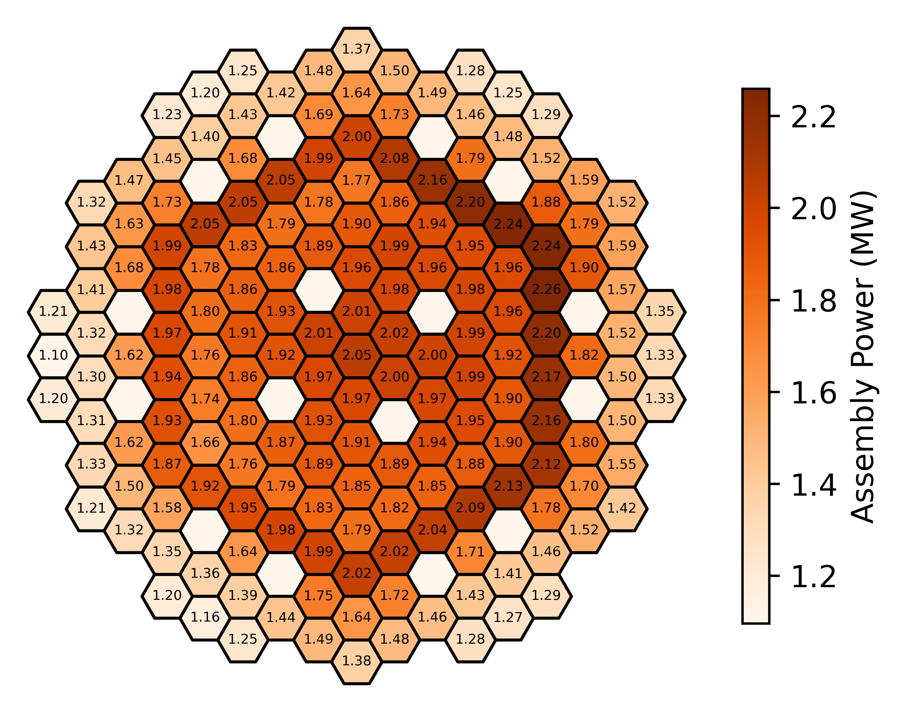

# hexcore-powermap
Visualization of hexagonal reactor core power distributions with labeled assemblies and gradient mapping.

This [tool](src/power_distribution_grid_plot.py) reads assembly-wise power values from CSV files, maps them onto a hexagonal grid, and generates a **core power distribution plot** with numerical labels and a color gradient. A colorbar legend is included for reference.

## Input Data Requirements

Both [inner_FAs.csv](data/inner_FAs.csv) and [outer_FAs.csv](data/outer_FAs.csv) must contain **assembly power values** in terms of their grid coordinates as follows:

| x    | y    | Power (MW) |
| ---- | ---- | ---------- |
| 0    | 0    | 2.15       |
| 1    | -1   | 1.78       |
| 2    | 0    | 1.34       |

- **x, y** → axial grid coordinates of the hex assembly (details about the hex grid indexing can be found [here](https://terrapower.github.io/armi/gallery/framework/run_grids1_hex.html).  
- **Power (MW)** → assembly power value, floating-point.  

You may combine or split the dataset as needed. The plotting script merges the two CSVs internally.

## Example Output

